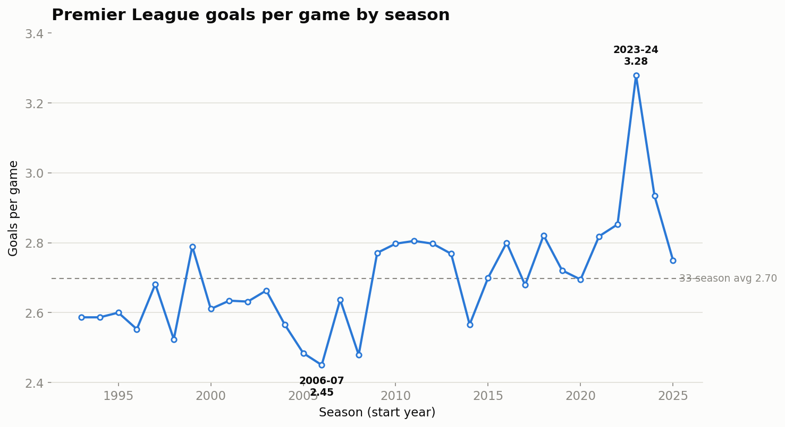

# premier-league-data

**Open, pip-installable English Premier League results — with every bookmaker's
odds kept intact.** Every season from **1993-94 to the present** (12,700+
matches), cleaned into two tidy tables and bundled so they load in one line.

Most public "PL results" datasets throw away the betting odds. This one keeps
them all — including **opening *and* closing** prices — which is what makes
closing-line and market-efficiency analysis possible.

> **Data source: [football-data.co.uk](https://www.football-data.co.uk/).**
> This project only fetches, cleans, and reshapes their freely published files.
> See [Data source & licensing](#data-source--licensing).



## Install

```bash
pip install git+https://github.com/AnishKhetani/premier-league-data
```

## Quickstart

```python
import premier_league_data as pl

results = pl.load_results()                       # 12,700+ matches, all seasons
table   = results[results.season == "2023-24"]    # slice a single season
odds    = pl.load_results_with_odds("2023-24")     # same rows + every bookmaker's odds
print(pl.available_seasons()[:3])                  # ['1993-94', '1994-95', '1995-96']
print(odds[["home_team", "away_team", "bet365_1x2_home_close"]].head())
```

See [`examples/quickstart.ipynb`](examples/quickstart.ipynb) for rebuilding a
season's final league table, head-to-head records, and the chart above.

## The data

Two tables, each shipped as **CSV and Parquet** in [`data/processed/`](data/processed/)
and bundled inside the package (so `load_*` works with no download).

### `results` — core match results

Loaded with `load_results()`. One row per match, standardized across every era.

| column        | type       | description                                        |
|---------------|------------|----------------------------------------------------|
| `match_id`    | str        | stable unique id, `{code}-{home_slug}-{away_slug}` |
| `season`      | str        | e.g. `2023-24`                                     |
| `season_code` | str        | football-data code, e.g. `2324`                    |
| `date`        | datetime   | match date, resolved to full year                  |
| `home_team`   | str        | home side                                          |
| `away_team`   | str        | away side                                          |
| `fthg`        | Int64      | full-time home goals                               |
| `ftag`        | Int64      | full-time away goals                               |
| `ftr`         | str        | full-time result: `H` / `D` / `A`                  |
| `hthg`        | Int64      | half-time home goals (`NA` before 1995-96)         |
| `htag`        | Int64      | half-time away goals (`NA` before 1995-96)         |
| `htr`         | str        | half-time result (`NA` before 1995-96)             |
| `referee`     | str        | referee (`NA` before ~2000-01)                     |

### `results_with_odds` — results + all bookmaker odds

Loaded with `load_results_with_odds()`. The match-identity keys (`match_id`,
`season`, `date`, `home_team`, `away_team`) plus **183 odds columns**.

| column                       | type    | description                                    |
|------------------------------|---------|------------------------------------------------|
| `match_id`                   | str     | join key back to `results`                     |
| `season`, `date`, `home_team`, `away_team` | –    | match identity                    |
| `{bookmaker}_1x2_home`       | float   | home win odds (decimal)                        |
| `{bookmaker}_1x2_draw`       | float   | draw odds                                      |
| `{bookmaker}_1x2_away`       | float   | away win odds                                  |
| `{bookmaker}_1x2_home_close` | float   | **closing** home odds (`_close` = closing line)|
| `{bookmaker}_over25`         | float   | over 2.5 goals                                 |
| `{bookmaker}_under25`        | float   | under 2.5 goals                                |
| `{bookmaker}_ah_home` / `_ah_away` | float | Asian-handicap prices                      |
| `ah_line`                    | float   | market Asian-handicap line                     |

Odds are **sparse** — a column is `NaN` for seasons where that bookmaker/market
wasn't quoted. Odds columns follow football-data's `{book}[C]{market}` grammar,
renamed `{bookmaker}_{market}[_close]`. Bookmakers & aggregators covered:

> bet365 · pinnacle · william­hill · bwin · interwetten · ladbrokes · vcbet ·
> betvictor · coral · betmgm · betfair (exchange & sportsbook) · gamebookers ·
> stan james · sportingbet · blue square · 1xbet · **market_max / market_avg**
> (and legacy **betbrain_max / betbrain_avg**)

The three Betbrain price-*count* columns (`Bb1X2`, `BbOU`, `BbAH`) keep their
original names. Full details in [SPEC.md](SPEC.md).

## Regenerate from source

The data is reproducible end-to-end — nothing here is hand-edited.

```bash
pip install -e ".[dev]"           # dev install with fetch/plot deps
python scripts/fetch_data.py      # download all seasons -> data/raw/ (gitignored)
python scripts/build_dataset.py   # clean + combine -> data/processed/ (CSV + Parquet)
```

The current season refreshes automatically: a [GitHub Actions
workflow](.github/workflows/refresh-data.yml) re-runs the pipeline on Monday
mornings during the season and opens a PR when the data changes.

## Data source & licensing

**All data comes from [football-data.co.uk](https://www.football-data.co.uk/),**
which publishes free historical football results and odds. This project does not
create the underlying data — it only fetches, cleans, and reshapes it. **If you
use this data, please credit football-data.co.uk.**

- **Pipeline code:** MIT licensed — see [`LICENSE`](LICENSE).
- **Underlying data:** this project claims **no license or ownership** over it.
  football-data.co.uk states no explicit redistribution terms, so review their
  site before redistributing. See [`DATA_LICENSE.md`](DATA_LICENSE.md).
